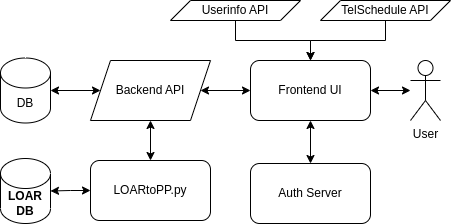

Ptolemy Front End and API Deployment
======================================

High Level Architecture
-----------------------

Ptolemy interfaces with the ODT API, which access data stored in different areas. 

When a User Logs On
^^^^^^^^^^^^^^^^^^^

Upon entering the site, the user is immediately routed authentication server where they log in. Upon successful login, they are brought back
to the Ptolemy with an authentication cookie. This cookie is used to obtain a user's information from the ODT API, 
allowing Ptolemy to acquire OBs that are submitted to the Execution Engine.

Architectural view of Ptolemy and how it interfaces with other elements. 

Build and Change Procedure
---------------------------

Frontend
^^^^^^^^
While as webdev@vm-www3build navigate to ``path/to/project`` and enter the command ``npm run build``.
When complete the frontend will be in the ``build`` file. Run as dsibld account.

.. code-block:: bash 

   cd /ddoi/observers/
   git clone https://github.com/KeckObservatory/ptolemy.git 
   cd ./ptolemy
   npm install
   npm run build
   make install

In a browser go to vm-ddoiserverbuild/observers/ptolemy/build/index.html

Backend
^^^^^^^
In a separate terminal execute the following lines of code as dsibld account

.. code-block:: bash 

   cd /ddoi/observers/ptolemy/backend
   kpython3 app.py
