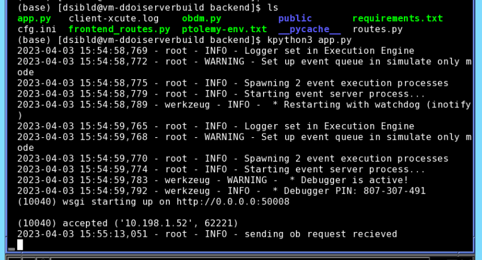

Ptolemy Front End and API Deployment
======================================

Ptolemy interfaces with the ODT API, which access data stored in the ODT database. 

When a User Logs On
^^^^^^^^^^^^^^^^^^^

Upon entering the site, the user is immediately routed authentication server where they log in. Upon successful login, they are brought back
to the Ptolemy with an authentication cookie. This cookie is used to obtain a user's information from the ODT API, 
allowing Ptolemy to acquire OBs that are submitted to the Execution Engine.

.. warning:: WARNING:
   There is a bug in the authentication server that, upon sucessfully logging in reroutes the user back to the login page.
   Try deleting cookies before logging in.

Build and Change Procedure
---------------------------

Frontend
^^^^^^^^
While as dsibld@vm-ddoiserverbuild navigate to ``path/to/project`` and enter the command ``npm run build``.
When complete the frontend will be in the ``build`` file. Run as dsibld account.

.. warning:: WARNING:
   You may need to run ``./env`` to set the correct path to npm/node in order to build the frontend. 
   This is due to there being another executable called "node" installed in kroot.

.. code-block:: bash 

   cd /www/observers/
   git clone https://github.com/KeckObservatory/ptolemy.git 
   cd ./ptolemy
   ./env
   npm install
   npm run build

.. note:: Note:
   When changing the frontend interface, run `npm run build` again to rebuild the GUI. 
   If a library has changed you must run `npm install && npm run build` instead.

In a browser go to `http://vm-ddoiserverbuild/observers/ptolemy/build/index.html <http://vm-ddoiserverbuild/observers/ptolemy/build/index.html>`_.
After logging in using your Windows account username and password, you should be greeted
by the Ptolemy GUI. 

Backend
^^^^^^^
In a separate terminal as dsibld@vm-ddoiserverbuild, execute the following lines of code. 

.. code-block:: bash 

   cd /ddoi/observers/ptolemy/backend
   kpython3 app.py

In another terminal, as dsibld@vm-ddoiserverbuild, execute the following lines of code. 

.. code-block:: bash 

   cd /ddoi/observers/ptolemy/backend
   kpython3 ee_client.py

Refresh the frontend. The frontend automatically connects to the backend. 
If the connection was successful you should see something similar to what is shown in the terminal below. 

.. note:: Note:
   Changes to the backend, require you to restart the server with run `kpython3 app.py` and `kpython3 ee_client.py`. Changes to the ExecutionEngine and TranslatorModule packages also
   require a restart in this way. Keep in mind that Ptolemy's sequence and event queue state will be lost when restarting the backend. 
   The OB queue is saved, but the sequence and event queues need to be remade.

Python Libraries
^^^^^^^^^^^^^^^^
DDOI libaries located at ``/ddoi`` are linked to kpython3 and imported like any other library. Updating these libraries are 
made using ``git pull`` for example, 

.. code-block:: bash 

   cd /ddoi/ExecutionEngine/default/DDOIExecutionEngine
   git pull

Changes to the ExecutionEngine and TranslatorModule packages require a restart of the backend running on `app.py` and `ee_client.py`. 

DDOI KTL Services
^^^^^^^^^^^^^^^^^

Execution Engine KTL services are set by running the following command(s):

.. code-block:: bash

   /kroot/rel/default/sbin/k2ddoid -c /kroot/rel/default/data/k2ddoi.conf