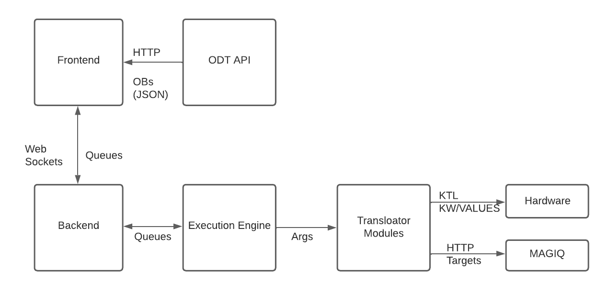

Welcome to Ptolemy's Documentation!
==========================================

Overview:
---------

`Ptolemy <https://github.com/KeckObservatory/ptolemy>`_ is an implementation of the Execution Engine GUIS described in 
`DDOI design documents <https://keckobservatory.atlassian.net/wiki/spaces/DSI/pages/1292402729/Execution+Engine+-+Software+Design>`_.
It takes apart an OB and parses it into sequences and then into events.

Ptolemy at its core is a Python Flask Server, which stores the OB, Sequence, and Event queues, and acts 
as the interface between the user and the Execution Engine. The user 
manages the queues: adding, removing, and sorting items in their respective queues. 
When the user is ready, they execute the events via a button, which spawns a 
separate process that runs the translator module. 

By design there can only exist one OB, Sequence, and Event queues at a time. 
There can, however be multiple instances of the Front end. The State is shared 
across all instances. 

Users are designated to the roles of either Keck Employee (OA/SA) Observer, or OA. 
An Observer's role is to manage the queues and submit events.
The Keck Employee monitors the users GUI, interceeding when necessary.
The OA's role is to observe the Event Queue only.
EE state is mirrored across all GUI instances such that all GUI instances have the same state.

   .. figure:: _static/ptolemy-ob-to-hw.png
      :width: 800

Architectural view of Ptolemy and how it interfaces with other elements. 

Use Cases:
----------

An observer selects from their pool of OBs a subset to be observed for the night. 
They sort the OBs in the order at which they are to be observed. 
An OB is submitted when they select the "Submit Top OB" button. 
The OB sequences are broken down into another queue. 
Before they can submit sequences, the user Presses the "Submit Acquisition"
button, which generates the events needed to slew, acquire, and guide a target. 
Those events are fired off one-by-one with the "Submit Event" button. 

While all this is happening, a Keck Employee has a Ptolemy instance running on their work station's screen, seeing what the observer is seeing.

Interconnected Systems:
-----------------------

Ptolemy has several interfaces, detailed in the figure below. 

* Backend to Frontend interface with WebSockets. This is how OB, Sequence, and Event items are transmitted
  across the front end GUI. 

* Frontend to ODT acquires the Observers OBs via the ODT API. 

* The Ptolemy Backend has an instance of the Execution Engine running as a separate process from the Flask Server.

* Submitting an event triggers the Execution Engine to call on the event's execution function,
  which is run in a separate process, managed by a Python queue object.
  From there the function calls on KTL keywords/calls which interfaces 
  with MAGIQ and instrument/telescope hardware. 

.. toctree::
   :maxdepth: 2
   :caption: Contents:

   build
      
   troubleshooting 

Software Source Control 
-----------------------
* Github source for the GUI and backend is located at `https://github.com/KeckObservatory/ptolemy <https://github.com/KeckObservatory/ptolemy>`_

Security
--------

P-Squared is accessible through observers, and has authorization control thru the ODT API.
Anyone with an observer account and internal network access can log in
and view and control Ptolemy, no matter the observer!
Be careful!

Indices and tables
------------------

* :ref:`genindex`
* :ref:`modindex`
* :ref:`search`
   
