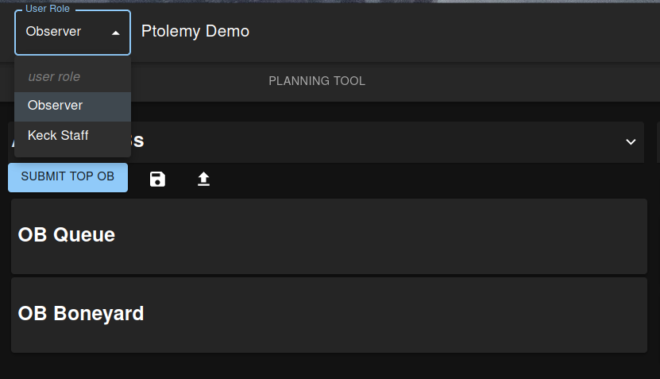
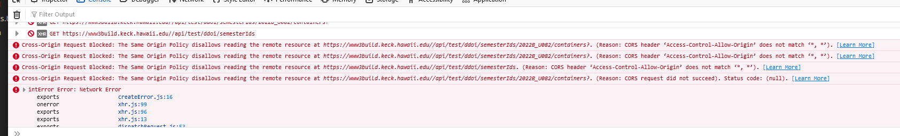
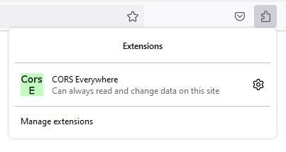

Troubleshooting & FAQ
=====================

A. **Login thru API is not routing correctly**

A bug with the authentication server jumbles up some of the text. just alter the URL from `https://http//vm-ddoiserver...` to `http://vm-ddoiserver...` after logging in.

B. **I cannot see available OBs.**

Select "Observer" in the upper right drop down menu. See figure below.

C. **My queues are gone after I updated the server.**

The queues are stored in memory by the process running the main Flask Server. Once its killed the memory is lost.

D. **Upon entering Ptolemy, my screen is blank and the console logs are reporting a "Cross-Origin Request Blocked" error.** 

Another bug. The ODT API expects that the JavaScript app URL calling it matches its own server (www3build.keck.hawaii.edu).
Ptolemy originates in vm-ddoiserverbuild.keck.hawaii.edu, so it raises an error once it finds out the response origin header doesn't match. 
This is to prevents other apps from accessing the ODT API. 

A workaround is to install a "CORS Everywhere" browser extension. 

Training
========

A video to how to use the tool will be provided at a later date 

